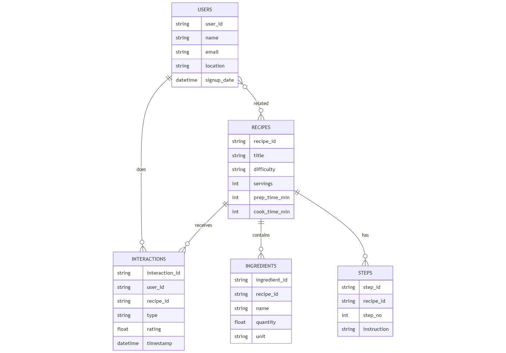

# 🍽️ Recipe Analytics Pipeline

A complete **Python-based Data Engineering Pipeline** designed to **extract, transform, validate, and analyze** semi-structured recipe data stored in **Firebase Firestore**.

This project follows a full **ETL workflow**, ensures **data quality validation**, and generates **10+ analytics insights** with visualizations.

---

## 📌 Project Overview

This project was developed as part of a Data Engineering Assessment and includes:

* **Recipes Collection** (recipes metadata, ingredients, steps)
* **Users Collection** (basic profile info)
* **Interactions Collection** (ratings, likes, attempts, views)
* **ETL Export Layer** (Firestore → CSV)
* **Validation Layer** (schema & relationship checks)
* **Analytics Layer** (charts, KPIs, insights)

---

## 🏗️ Architecture Diagram

A high-level view of the data flow from ingestion to final analytics.


---

## 📘 ER Diagram

A model illustrating the relationship between the normalized collections/tables.



---

## 🔄 Data Flow Diagram

Details the sequence of processing steps within the ETL and validation layers.


---

## 📂 Project Structure
```
project-folder/
│
├── data/
│ ├── analytics/ # Generated charts & insights
│ └── validation/ # Validation errors & reports
│
├── etl_export_to_csv.py # Extract Firestore → CSV
├── validate_csv_data.py # Data quality checks
├── analysis.py # Analytics & visualizations
│
├── recipe.py # Upload recipes
├── users.py # Upload users
├── interaction.py # Upload interactions
│
└── RecipeAccountKey.json # Firebase service key
```
