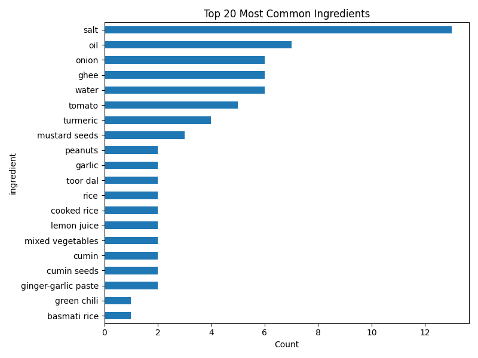
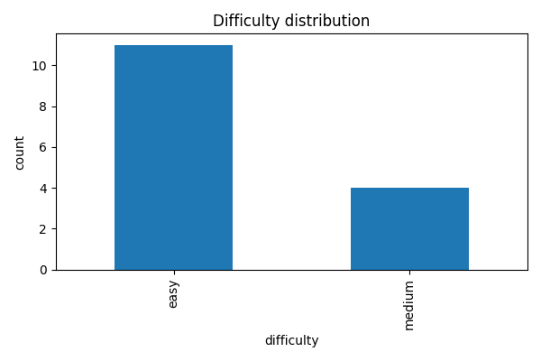
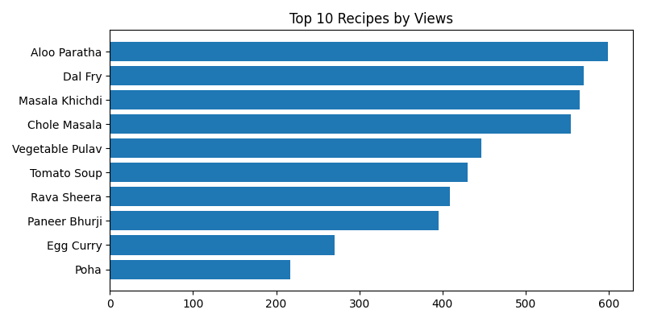
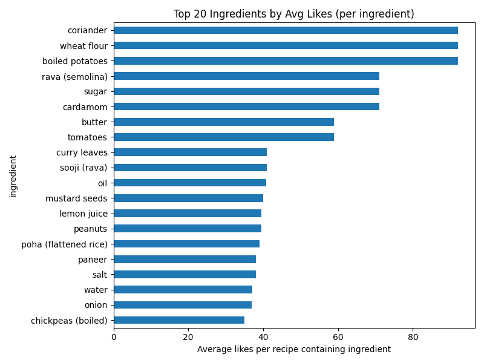
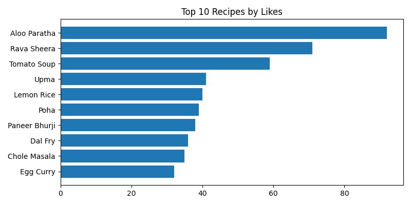
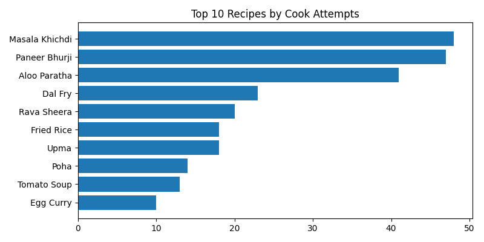
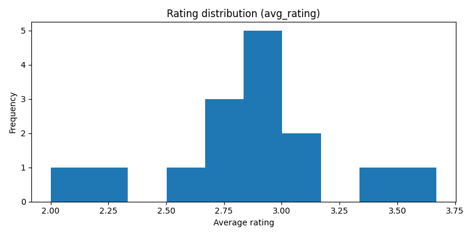
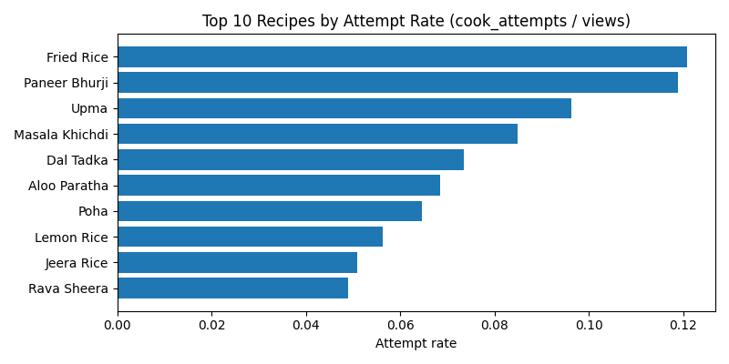

# 🍽️ Recipe Analytics Pipeline

A complete **Python-based Data Engineering Pipeline** designed to **extract, transform, validate, and analyze** semi-structured recipe data stored in **Firebase Firestore**.

This project follows a full **ETL workflow**, ensures **data quality validation**, and generates **10+ analytics insights** with visualizations.

---

## 📌 Project Overview

This project was developed as part of a Data Engineering Assessment and includes:

* **Recipes Collection** (recipes metadata, ingredients, steps)
* **Users Collection** (basic profile info)
* **Interactions Collection** (ratings, likes, attempts, views)
* **ETL Export Layer** (Firestore → CSV)
* **Validation Layer** (schema & relationship checks)
* **Analytics Layer** (charts, KPIs, insights)

---

## 🏗️ Architecture Diagram

A high-level view of the data flow from ingestion to final analytics.


---

## 📘 ER Diagram

A model illustrating the relationship between the normalized collections/tables.


---

## 🔄 Data Flow Diagram

Details the sequence of processing steps within the ETL and validation layers.


---

## 📂 Project Structure
```
project-folder/
│
├── data/
│ ├── analytics/ # Generated charts & insights
│ └── validation/ # Validation errors & reports
│
├── etl_export_to_csv.py # Extract Firestore → CSV
├── validate_csv_data.py # Data quality checks
├── analysis.py # Analytics & visualizations
│
├── recipe.py # Upload recipes
├── users.py # Upload users
├── interaction.py # Upload interactions
│
└── RecipeAccountKey.json # Firebase service key
```

## 🗃️ Data Model

### 👤 Users Collection

| Field         | Description                     |
| :------------ | :------------------------------ |
| **user\_id** | Unique identifier               |
| name          | User name                       |
| email         | Email address                   |
| location      | User location                   |
| preferences   | Array of category preferences   |
| signup\_date  | Date user joined                |

### 🍽️ Recipes Collection

| Field           | Description                           |
| :-------------- | :------------------------------------ |
| **recipe\_id** | Unique recipe ID                      |
| title           | Recipe title                          |
| difficulty      | Easy / Medium / Hard                  |
| servings        | No. of servings                       |
| prep\_time\_min | Preparation time                      |
| cook\_time\_min | Cooking time                          |
| tags            | Array of tags                         |
| ingredients     | `[]{ name, quantity, unit }`          |
| steps           | `[]{ step_no, instruction }`          |
| created\_at     | Timestamp                             |
| updated\_at     | Timestamp                             |

### ⭐ Interactions Collection

| Field             | Description            |
| :---------------- | :--------------------- |
| **recipe\_id** | Recipe reference       |
| avg\_rating       | Average rating         |
| rating\_count     | Total ratings          |
| likes             | Total likes            |
| cook\_attempts    | Attempts               |
| views             | Total views            |

---
### Instructions for Running the Pipeline

## Step 1: Environment Setup

### 1. Clone the Repository

Clone the project code from GitHub and navigate into the main directory.

```bash
git clone <repository-url>
cd <project-directory>
```

### 2. Create and Activate Virtual Environment

Virtual environments ensure project dependencies do not conflict with your system-wide Python installation.


```bash
# Windows
python -m venv .venv
.\.venv\Scripts\activate

# macOS/Linux
python3 -m venv .venv
source .venv/bin/activate
```
### 3. Install Dependencies
Use the dependency list to install all necessary Python libraries.


```bash
pip install firebase-admin pandas python-dateutil matplotlib pillow
```
## Step 2: Firebase Configuration

This project requires a secure connection to your **Firebase Firestore database** using a service account key.

### 1. Create a Firebase Project

1. Go to the [Firebase Console](https://console.firebase.google.com/).
2. Click "**Add project**" and follow the setup wizard.

### 2. Set up Firestore Database

1. In the Firebase Console, navigate to the "**Firestore Database**" section.
2. Click "**Create database**" and start in production mode.
3. Choose a location close to your users.

### 3. Generate Service Account Key

1. Go to **Project Settings** (gear icon next to "Project Overview") > **Service Accounts**.
2. Click "**Generate new private key**".
3. Save the JSON file (e.g., `your-key-name.json`) in your project root, or a secure location referenced by your scripts.

### 4. Configure Scripts

Crucially, update the `SERVICE_ACCOUNT_PATH` variable in all seeding and ETL scripts to point to the correct path of your downloaded JSON key file.

```python
# The following files must be updated:
# recipe.py
# users.py
# interaction.py
# etl_export_to_csv.py

# Example update inside each file:
SERVICE_ACCOUNT_PATH = r"/path/to/your/your-key-name.json"
```

## Execution of Pipeline

The pipeline must be run in **four sequential phases** to ensure data dependencies are met (e.g., ETL cannot run before the database is seeded).

### Phase 1: Database Seeding (Data Setup)

This phase uses the three dedicated seeding scripts to populate your **Firestore instance** with sample recipe, user, and interaction data, fulfilling the source data setup requirement.

**Commands:**
```bash
python recipe.py
python users.py
python interaction.py
```
### Phase 2: ETL Process (Extract, Transform, Load)

The `etl_export_to_csv.py` script connects to **Firestore**, reads the collections, performs the required normalization (flattening nested ingredient/step arrays and aggregating interaction metrics), and loads the output into a local staging area.

**Command:**
```bash
python etl_export_to_csv.py
```
### Phase 3: Data Quality Validation
The validate_csv_data.py script reads the normalized CSVs and applies the defined data quality rules (e.g., non-negative numeric fields, valid categorical values like 'difficulty', and referential integrity checks).
**Command:**
```bash
python validate_csv_data.py
```
### Phase 4: Analytics and Visualization
The final script, analysis.py, consumes the clean, validated CSV data, merges the tables, computes the required 10+ insights, and generates various charts using matplotlib.
**Command:**
```bash
python analysis.py
```
### 📈 Insights Summary

The `analysis.py` script successfully generates over **10 key insights and visualizations**, providing actionable business intelligence about the recipes and user engagement.

1. **Most Common Ingredients**
    * Identifies the top 20 ingredients used across all recipes (e.g., Rice, Salt, Onion).
   
---
2. **Difficulty Distribution**
  * Bar chart showing the count of recipes categorized as Easy, Medium, and Hard.
   
---

3. **Top Recipes by Views**
  * Bar chart identifying the 10 most frequently viewed recipes.
   
---
4. **Ingredients by Avg Likes**
  * Identifies the top 20 ingredients whose presence correlates with a high average number of likes per recipe.
    
---
5. **Top Recipes by Likes**
    * Bar chart showing the 10 recipes with the highest total like counts.
    
---
6. **Top Recipes by Cook Attempts**
  * Highlighting the 10 recipes that users attempted to cook most often.
  
---
7. **Rating Distribution**
  * Histogram showing the frequency of average ratings (1.0 to 5.0) across all recipes.

8. **Top Attempt Rate**
  * Calculates and charts the top 10 recipes based on the conversion rate of views to cook attempts (cook_attempts / views).


## ⚠ Known Limitations

* Service account path is **hardcoded** in scripts (should use environment variables for security).
* Designed for a **small dataset** (~15–20 recipes).
* Users table **not used** in the analytics phase.
* Validation checks are currently **schema-level only** (e.g., basic field checks, foreign key check).

---
## 🤝 Contributing

Contributions are welcome! Feel free to open an issue or submit a pull request if you find a bug or have an idea for an improvement.


## 📞 Contact

* **Name:** Prasad Bari
* **Email:** prasadbari1515@gmail.com

---

## ✅ Next Steps

> Ready to start? Head over to the **Step 1: Environment Setup** section above to begin configuring your pipeline!
